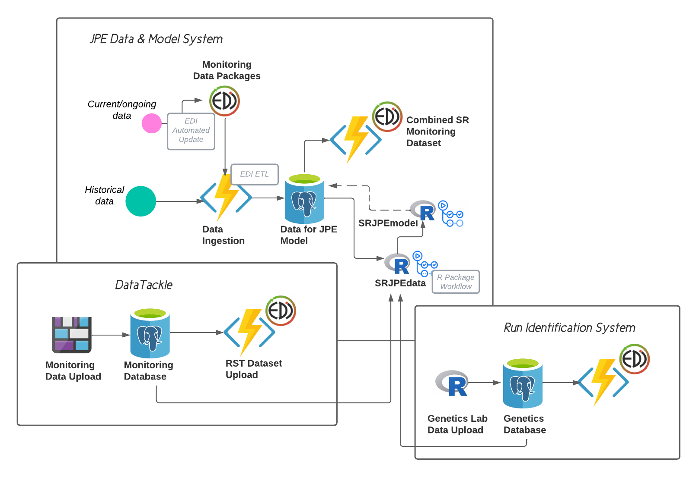
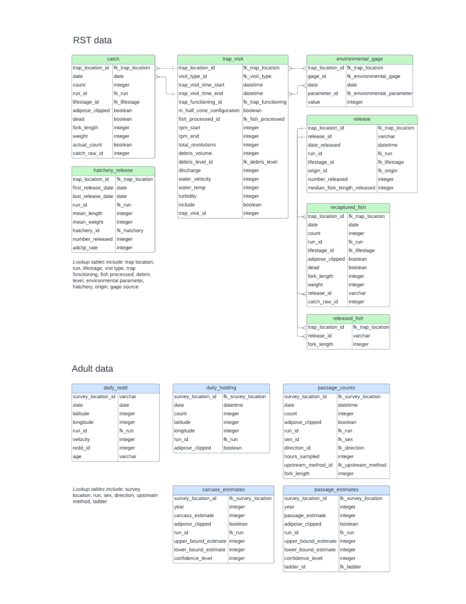
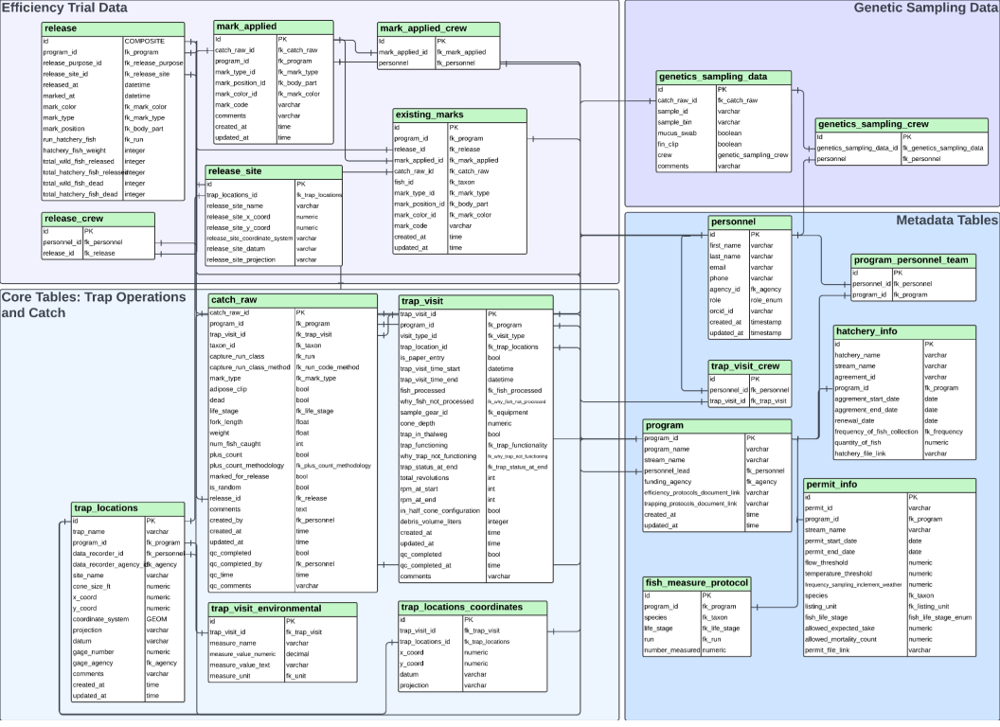

# SR JPE Data Management Plan

The goal of this document is to describe the data used in SR JPE modeling and how those data are being managed for usability, accessibility, interoperability, and near real-time updates of the SR JPE models. 

This document is still a work in progress and iteratively updated (and in some places incomplete).

Please contact Ashley Vizek (avizek@flowwest.com) with questions regarding this documentation.

## Project Overview

The SR JPE data management system is comprised of a suite of data storage, processing, and access components. This system is working to align with current salmonid data management across agencies while also transitioning to a modernized system. 

1. **SR JPE Data and Model**: Currently, RST data is collected on paper field sheets and entered in an Access database. Data collection protocols, data naming conventions, and data structure varies across programs. The JPE Data and Model System is designed to handle salmonid monitoring data as it currently exists. 

2. **DataTackle**: In order to move toward high quality data that is available in near real-time, the existing data lifecycle needed to be modernized. The DataTackle component of the SR JPE system is the modernized component of salmonid monitoring data management and includes a tablet application for RST data collection resulting in data that are high quality (due to data validation and QC modules within the application), interoperable (data collected through the application will be stored in a standard format), and usable in near real-time (automated posted to EDI). 

3. **Run ID**: Genetic data collection and modeling is an important component of the SR JPE and is handled through the Run Identification component which involves data entry tools for the genetic lab and a database for the storage of genetics data.

Data from different SR JPE system components are integrated and made available and usable for SR JPE modeling through the SRJPEdata R package. The SRJPEmodel package contains model code that relies on data inputs prepared in the SRJPEdata package.

{ width=50% }

## Existing Data Resources {.tabset}

The SR JPE utilizes the following types of data:

* Salmonid monitoring
    * Juvenile outmigration (e.g. rotary screw trap data)
    * Adult monitoring data including upstream passage, holding surveys, redd surveys, carcass surveys
* Coded-wire-tag (CWT) data for survival models
* Flow and temperature data
* Genetic samples and analysis for run designation

For each data type, the sections below describe where the data are derived from and how they are being managed and stored for the SR JPE.

### Salmonid Monitoring Data

#### Source Data

Salmonid monitoring data are collected and managed by the California Department of Fish and Wildlife (CDFW), Department of Water Resources (DWR), and US Fish and Wildlife (USFWS). FlowWest supported each program in making data publicly available via the Environmental Data Initiative (EDI). All RST data are now available on EDI, and adult data are expected to be available by the end of March (Table 1). 

Currently, these data are collected in the field using paper field sheets and entered into a local Access database. The SR JPE system utilizes the publicly available data resource and has developed an extract-transform-load (ETL) process for downloading data from EDI, processing the data into a standard format that allows integration across streams, and loading that data into a PostgreSQL database within the California Natural Resource Agency Microsoft Azure Resource Group[^1] on a biweekly schedule. 

[^1]: System design documents for the SR JPE data management infrastructure exist if more detailed information is needed. 

Deer and Mill creeks are in the process of transitioning to an electronic data collection system for rotary screw trap (RST) data where data are entered in a data collection application called DataTackle and posted to a cloud-based database in Microsoft Azure. Ultimately, other programs may transition to DataTackle as it improves data quality, eliminates data entry time, and streamlines data access.

*Table 1. Describes data resources for salmon monitoring data by watershed. Metadata is available at the EDI link specified within the table.*

| Watershed | Rotary Screw Trap Data | Adult Monitoring Data |
| --------- | ---------------------- | --------------------- |
| Battle Creek | [edi.1509](https://portal.edirepository.org/nis/mapbrowse?packageid=edi.1509.1) | EDI package |
| Butte Creek | [edi.1497](https://portal.edirepository.org/nis/mapbrowse?packageid=edi.1497.1) | EDI package |
| Clear Creek | [edi.1509](https://portal.edirepository.org/nis/mapbrowse?packageid=edi.1509.1) | EDI package |
| Deer Creek | [edi.1504](https://portal.edirepository.org/nis/mapbrowse?packageid=edi.1504.1) | EDI package |
| Feather River | [edi.1239](https://portal.edirepository.org/nis/mapbrowse?packageid=edi.1239.6) | EDI package |
| Mill Creek | [edi.1504](https://portal.edirepository.org/nis/mapbrowse?packageid=edi.1504.1) | EDI package |
| Sacramento River | [edi.1501](https://portal.edirepository.org/nis/mapbrowse?packageid=edi.1501.1) | No adult data |
| Yuba River | [edi.1529](https://portal.edirepository.org/nis/mapbrowse?packageid=edi.1529.2) | EDI package |

#### Quality Control

Each monitoring program performs there own QC on data which often includes manual checks when entering data and end of season checks. FlowWest conducted QC on historical datasets when received from monitoring programs (see [JPE-datasets repository](https://github.com/SRJPE/JPE-datasets)).

#### Data Updates

The RST EDI packages described in Table 1 are updated on a biweekly schedule. On the second and fourth Wednesdays of each month, Data Stewards export data and email to data@flowwest.com to initiate an automated update process for their EDI package[^2]. This process is needed to facilitate near real-time updates to SR JPE models.

[^2]: This process is managed within Microsoft Azure and also utilizes Github Actions. Instructions for exporting and emailing data are included as an Appendix. Please contact X for more information.

Data uploaded within a monitoring season are considered provisional as additional QC is conducted at the end of the monitoring season.

#### Repository Links

* [Initial data QC and processing](https://github.com/SRJPE/JPE-datasets)

Prepare RST data for publication

* [Battle and Clear creeks RST EDI package](https://github.com/FlowWest/edi-battle-clear-rst)
* [Butte Creek RST EDI package](https://github.com/SRJPE/jpe-butte-edi)
* [Deer and Mill creeks RST EDI package](https://github.com/SRJPE/jpe-deer-mill-edi)
* [Feather River RST EDI package](https://github.com/SRJPE/jpe-feather-edi)
* [Sacramento River Knights Landing RST EDI package](https://github.com/SRJPE/jpe-knights-edi)
* [Sacramento River Tisdale RST EDI package](https://github.com/SRJPE/jpe-tisdale-edi)
* [Sacramento River Delta Entry RST EDI package](https://github.com/SRJPE/jpe-delta-entry-edi)
* [Yuba River RST EDI package](https://github.com/SRJPE/jpe-yuba-edi)

Prepare adult data for publication (to be added when published)

### Coded Wire Tag Data

#### Source Data

#### Quality Control

#### Data Updates

#### Repository Links

### Flow and Temperature Data

#### Source Data

Flow and water temperature are important covariates in many aspects of SR JPE, and exist in multiple repositories. Often there are multiple data sources for a given watershed and we have worked to identify the data source of highest quality, with fewest data gaps, that is more representative of a particular habitat type. Currently, these data are not stored in an SR JPE database to reduce redundancy and instead are pulled into the SRJPEdata package via an API. 

#### Quality Control

#### Data Updates

Covariate data is available via APIs through USGS or CDEC. The data update process of these existing datasets is not facilitated through SR JPE.

#### Repository Links

### Genetic Data

#### Source Data

#### Quality Control

#### Data Updates

#### Repository Links

## SR JPE Data Resources {.tabset}

The SR JPE has created a number of data resources for integrating, managing, storing, and making data accessible for use. The first step in integrating disparate data was to make those datasets publicly available (see Table 1, insert table for genetics data). Data could then be pulled from these public repositories and integrated for use in SR JPE modeling. We utilize a suite of PostgreSQL databases hosted on Microsoft Azure and in all cases the data stored in the databases can be accessed through EDI. To make the data readily usable for SR JPE modeling we created an R data package called SRJPEdata and to run SR JPE models we compiled and functionalized model code developed by SR JPE modelers including Josh Korman, Flora Cordoleani, Liz Stebbins, and Noble Hendrix. 

### SR JPE Model Database

The SR JPE requires data from multiple sources. The SR JPE model database was developed to serve as a comprehensive store for data inputs needed for modeling. Currently this database is focused on integrating salmonid monitoring data. As mentioned above, data are downloaded from EDI, processed into a standard format that allows integration across streams, and loaded into the database on a schedule (biweekly for RST, annual for adult). 

#### Entity Relationship Diagram

The diagram below is the entity relationship diagram (ERD) for the JPE model database.

{ width=100% }

#### Data Dictionaries

Data dictionaries are [here](https://docs.google.com/document/d/1Gj_a40Xu3dOD6l7jLv59KSasZoqLRC4kG0qejMHsmqo/edit?usp=sharing) and will be integrated into this documentation.

#### Quality Control

Validation scripts are included as part of the EDI to JPE model database ETL process. (insert more details about validation process)

#### Data Updates

#### Repository Links

* [Model database](https://github.com/SRJPE/jpe-db)

### DataTackle Database

Data Tackle refers to the electronic data entry system and associated cloud-based database for RST data. In comparison to data collected on field data sheets, Data Tackle improves data quality, eliminates data entry time, and streamlines data access resulting in real-time access to RST data. Ideally, all spring run tributaries will utilize Data Tackle; though, currently only Deer and Mill creeks are actively using this system with plans for Feather and Yuba rivers to be onboarded during the 2024 monitoring season and fully transitioned by the 2025 monitoring season.

#### Entity Relationship Diagram

The diagram below is the entity relationship diagram (ERD) for the DataTackle database.

{ width=100% }

#### Data Dictionaries

Data dictionaries are [here](https://docs.google.com/document/d/1MF3kaaRrQiO7NG4ltzkim9rHk4_H8kVgzyYJEalJKgI/edit?usp=sharing) and will be integrated into this documentation.

#### Quality Control

DataTackle contains extensive data validation to ensure data collected and entered are accurate. Additionally the application has a QC module to allow easy comparison of data points over time to identify outliers or errors.

#### Data Updates

Data collected via DataTackle are posted to the DataTackle database upon completion of data entry forms and internet connectivity. Data are updated on EDI at a weekly interval.

#### Repository Links

* [DataTackle database](https://github.com/SRJPE/rst-database)
* [DataTackle application](https://github.com/SRJPE/rst-pilot-app-client)
* [DataTackle server](https://github.com/SRJPE/jpe-app-server)

### Run ID Database

#### Entity Relationship Diagram

#### Data Dictionaries

#### Quality Control

#### Data Updates

#### Repository Links

* [grunID (Data entry tools)](https://github.com/SRJPE/grunID)
* [Run ID database](https://github.com/SRJPE/run-id-database)

### R Packages

The goal of the SRJPEdata package is to process data into the format required by SR JPE models so the package can easily be loaded and referenced within the SRJPEmodel package. Both R packages contain extensive documentation about data processing, rulesets, and models. 

#### Quality Control

#### Data Updates

#### Repository Links

* [SRJPEdata R package](https://github.com/SRJPE/SRJPEdata)
* [SRJPEmodel R package](https://github.com/SRJPE/SRJPEmodel)
