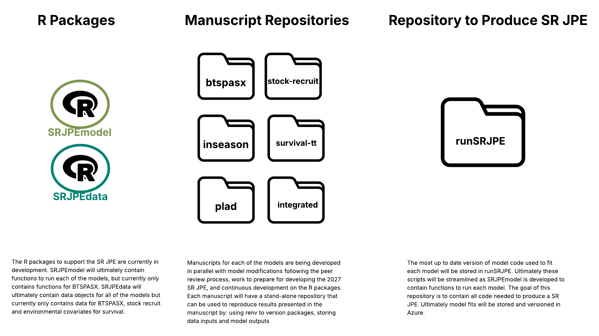

# Standard Operating Procedure for the Central Valley Spring Run Chinook Salmon Juvenile Production Estimate (SR JPE SOP)
*written by Ashley Vizek, updated June 12, 2026*

The SR JPE is a suite of interactive models for forecasting and hindcasting the abundance and timing of juvenile spring-run Chinook Salmon entering the Sacramento-San Joaquin Delta from the Sacramento River watershed. This document describes the seasonal workflow for updating data and refitting and running models to produce the SR JPE. The SR JPE will ultimately be fully transparent through open and reproducible model code and data that is updated weekly. The SR JPE will be updated on a regular basis throughout the water year as more data become available with the goal of reducing uncertainty in JPE estimates. 

The first SR JPE forecast will be produced for water year 2027 expected to be available starting January 2027. The long term and stable infrastructure that will be used to produce the SR JPE on a regular basis is still undergoing active development and is expected to continue throughout 2026. This does not prevent the development of a SR JPE. It means that there will be two workflows - (1) the **near-term workflow** meets the immediate need of producing a 2027 SR JPE and needs around manuscript publication related to the SR JPE models, and (2) the **regular SR JPE workflow** describes the ultimate step-by-step routine that will be used to produce an SR JPE on a regular annual and automated schedule into the future. April-October 2026 also includes a period of model modifications in response to the peer review which is described in TODO insert Section XX. The near-term workflow will include detailed step-by-step instructions and the guide for the regular workflow will continue to be built out throughout 2026 with more detail.

**Key Resources**
- (SRJPE GitHub Organization)[https://github.com/SRJPE] is where all code for the SR JPE program is stored, versioned and made accessible
- (SR JPE Data Management Plan)[https://github.com/SRJPE/system-design-docs/blob/main/srjpe_data_management_plan.md] a working document that describes data sources and products as well as the full data and model system for the SR JPE. The SOP is a companion document. The DMP documents the full data lifecycle whereas the SOP is focused on the instructions for producing and updating a SR JPE.
- (SRJPEdata R package)[https://github.com/SRJPE/SRJPEdata] R data package for data inputs to SR JPE models. This has been in active development alongside model code as new data needs arise. Ultimately this package will include tagged releases and DOI associated with manuscript publication and SR JPE estimates.
- (SRJPEmodel R package)[https://github.com/SRJPE/SRJPEmodel] R package with functions for running models. This package is in active development and not all models are included yet. This will continue to be developed as model code stabilizes.

## Near-Term Workflow

There are five submodels in the SR JPE - BTSPAS-X, survival (and travel time), PLAD, stock recruit, and inseason outmigrant - all of which come together in the integrated SR JPE model. The SR JPE model suite underwent peer-review in the winter of 2026, and models are currently undergoing active development and modifications. Modelers are also working to draft manuscripts for publication. In the background data scientists at FlowWest are working to functionalize model code and develop a data and model system that can be updated on a regular automated schedule. This full system (described in the "regular SR JPE workflow" section) may not be fully functional by January 2027, and we do not want it to get in the way of more immediate needs which is why we developed the near-term workflow. The main differences between these two workflows are that model code is not fully functionalized in `SRJPEmodel`, data objects may not be fully available in `SRJPEdata`, the procedure for running regular automated updates is not defined, and the near-term workflow prioritizes code and data publication for manuscripts.

### Overview

The goals for this workflow are (1) store, version, document, and make data and code open and transparent for the 2027 SR JPE, (2) organize code and data in preparation for publication in scientific journals, (3) enable a nimble workflow while components of the regular SR JPE system are being developed.

All code related to the SR JPE is stored and versioned on GitHub in the SRJPE Organization. To meet the needs of this workflow, there is a repository for each model (btspasx, survival, plad, stockrecruit, withinseason, integratedjpe) with the following file structure. The (model-code-template)[https://github.com/SRJPE/model-code-template] repository can be used as a template. The template includes .md files with best practices.

model-code-template/
├── README.md           # Project overview, setup, and reproduction instructions
├── LICENSE             # License governing code reuse
├── data/               # Input data files and data documentation
    ├── raw/            # Raw data files
    ├── processed/      # Processed data files
    └── data.md         # Description of data files
├── scripts/            # All analysis and modeling code
│   └── scripts.md      # Description of script execution order and purpose
└── results/            # All outputs generated by scripts (never edit by hand)
    ├── figures/        # Publication-ready figures
    ├── model-fits/     # Saved model objects and posterior samples
    └── tables/         # Summary tables

Before publication we will integrate [Zenodo](https://zenodo.org/) to generate a DOI for the repositories. Packages used in the manuscript will be versioned and locked through the use of `renv` and data inputs and model outputs will also be stored within the repository.

The following repository structure will support the ongoing development of R packages, manuscripts, and production of the 2027 SR JPE.

### Ongoing Development

#### 1. Model Updates

Starting January 2026 models (and data) have been undergoing updates and modifications in response to the peer-review and in preparation for manuscript publication to resolve lingering issues. Development is expected to continue through September 2026. Please refer to the working list of updates (INSERT LINK TO GOOGLE DOC WHEN READY TO SHARE, REFER TO SECTION OF GOOGLE DOC).

#### 2. Model Code

In addition to the model updates, during this time it is expected that all model code will be uploaded to the respective repository on GitHub (as discussed in the previous section). Ideally, modelers will version their updates; however, at the very least functional, publication-ready code will be available. It is expected that the code will be reproducible and FlowWest will test this by attempting to reproduce results for each model repository. FlowWest will support this process as needed including - implementing package versioning through `renv`, helping document code, providing scripts and workflows for large file and model fit storage, versioning data objects available in `SRJPEdata`, troubleshooting data issues.

**Expectation: All model code pushed to respective GitHub repository by end of June 2026. Code may continued to be modified through September.**

##### Model Repositories

- BTSPASX: https://github.com/SRJPE/bt-spas-x 
- Stock Recruit: https://github.com/SRJPE/stock-recruit
- Inseason: https://github.com/SRJPE/in-season
- Survival and Travel Time: https://github.com/SRJPE/survival-travel-time
- PLAD: https://github.com/SRJPE/plad

#### 3. Testing Model Code

FlowWest will work with modelers to test model code, ensuring that it is reproducible and meets the best practices for publication-ready code. 

**Expectation: All model code will be tested, reproducible, and publication-ready by end of September 2026. This will be completed in the following order: BTSPASX, stock recruit, survival/travel time, inseason, PLAD.**

#### 4. Integrated SR JPE

The development of an integrated SR JPE will require a number of decision points including (but not limited to):

- For stock recruit modeling: (1) what if adult data are not available, (2) what covariate is used
- For integrated model: (1) what prior is used if adult data are not available, (2) what forecast covariate is used

The modeling team will work to find resolution on these decision points and document them here.

**Expectation: The integrated SR JPE will be functional and decision points documented by end of September 2026**

#### 5. Development of the SR JPE report template

The 2027 SR JPE will be shared as a Quarto report with figures and explanatory text which may be accompanied by an interactive R Shiny application. This report will reference existing model documentation - manuscripts or draft manuscripts - by linking to model repositories and the `runSRJPE` repository. The goal for the regular production of the SR JPE is to develop a dashboard that will be updated regularly with SR JPE forecasts (at a frequency to be determined that could be as fine as biweekly). 

**Expectation: The report template will be drafted by end of September 2026. The full Modeling Team will review and agree on the template**

### 2027 SR JPE 

After the period of active development and preparation for manuscript publication concludes in September 2026, preparation for developing the 2027 SR JPE will begin. 

#### 1. Data updates

For the 2027 SR JPE to use the best available information, a number of data need to be updated first.

- RST (including efficiency trials) for BTSPASX (stock recruit and inseason depend on this)
- Acoustic telemetry for survival/travel time model
- Flow for BTSPASX
- Temperature (TODO - TBD how this is being used, potentially in stock recruit models)
- Genetics data for PLAD
- Adult data for the stock recruit

RST, flow, temperature, and adult data are in `SRJPEdata`. Acoustic telemetry and genetics data are in the process of being added to SRJPEdata. The sections below specify how to update each data type. For data in `SRJPEdata`, running [update_data.R](https://github.com/SRJPE/SRJPEdata/blob/main/data-raw/update_data.R) will update all data in the package. Note that the data pipeline will continue to be refined to move toward streamlined, automated updates.

##### RST

Currently, to update these data run (combine_database_pull_and_save.R)[https://github.com/SRJPE/SRJPEdata/blob/main/data-raw/pull_data_scripts/combine_database_pull_and_save.R]. RST data are regularly pulled from EDI and loaded in the SR JPE model database for storage. These data are integrated with data being collected using DataTackle and stored in the DataTackle database as well as misfit data that need to be pulled directly from EDI. To update the data inputs for the BTSPASX model, run (build_rst_model_datasets.R)[https://github.com/SRJPE/SRJPEdata/blob/main/data-raw/process_data_scripts/build_rst_model_datasets.R]

**Expectation: Pull data by end of June 2026. Define the annual QC process and the document the quality of the data. Ensure all data have been updated! Implement an automated workflow through GitHub Actions to run this script on a schedule by September 2026 though this is not critical for 2027 SR JPE but will help with biweekly data and model updates.**

##### Acoustic telemetry

The survival model currently does not rely on `SRJPEdata` for the acoustic telemetry data. The goal is to transition the data pull process for these data to `SRJPEdata`, however, the bigger priority is to ensure all the survival model code is up to date and available on GitHub. 

**Expectation: Data pull scripts will be available and reproducible on GitHub by end of June and updated with any new data. Ideally this will transition to SRJPEdata and an automated workflow through GitHub Actions will be implemented though is not critical for 2027 SR JPE but will help with biweekly data and model updates**

##### Flow 

Environmental data (weekly aggregation) are prepared and stored in `SRJPEdata`. Flow data are used by BTSPASX and summarized flow data are used in the survival model. Currently, to update these data run (pull_environmental_data.R)[https://github.com/SRJPE/SRJPEdata/blob/main/data-raw/pull_data_scripts/pull_environmental_data.R] and (forecast_covariates.Rmd)[https://github.com/SRJPE/SRJPEdata/blob/main/vignettes/forecast_covariates.Rmd] to update the summarized flow values for the survival model. To update the data inputs for the BTSPASX model run (build_rst_model_datasets.R)[https://github.com/SRJPE/SRJPEdata/blob/main/data-raw/process_data_scripts/build_rst_model_datasets.R]

**Expectation: Pull data by end of June 2026. Define the annual QC process and the document the quality of the data. Ensure all data have been updated! Implement an automated workflow through GitHub Actions to run this script on a schedule by September 2026 though this is not critical for 2027 SR JPE but will help with biweekly data and model updates**

##### Genetics data

Genetics data are stored in the `runid` database. FlowWest has been working with the DWR GEM Lab to streamline the data processing and upload process, and publish these data on (EDI)[https://portal.edirepository.org/nis/mapbrowse?packageid=edi.2335.1]. These data will be updated on EDI biweekly and pulled into `SRJPEdata` to do any processing needed. 

**Expectation: By end of June 2026, genetics data are published on EDI, an R script to pull these data into SRJPEdata is developed and tested. Implement an automated workflow through GitHub Actions to run this script on a schedule by September 2026 though this is not critical for 2027 SR JPE but will help with biweekly data and model updates**

##### Adult data

FlowWest worked with data collectors to publish adult datasets on EDI though due to the inconsistent and challenging structure of these datasets was only successful in publishing Yuba River adult passage estimates to EDI. Adult data are used in SR JPE stock recruit modeling and need to be updated ASAP in December-January. Beginning November 1 FlowWest will email data contacts (see below) to prepare for this data need and include the expected data type and structure. The (pull_adult_data.R)[https://github.com/SRJPE/SRJPEdata/blob/main/data-raw/pull_data_scripts/pull_adult_data.R] will need to be updated and then run to update `SRJPEdata`. In some cases, like for the Yuba River, adult data may not be available in time for the SR JPE stock recruit.

**Expectation: Data outreach for SR JPE adult data begins November 2026 and data are integrated by January 1 2027. This process needs to happen annually and will continue to be manual for the near future.**

#### 2. Model fit updates

##### BTSPASX

**July 2026**

The model repository, (bt-spas-x)[https://github.com/SRJPE/bt-spas-x], will be used for the manuscript development. Scripts to run the 2027 SR JPE will live in `runSRJPE`

In July 2026, BTSPASX will be refit with data from the 2025/2026 RST monitoring season following the procedure outlined (here)[https://github.com/SRJPE/bt-spas-x/blob/main/README.md].

**Expectation: Model refit and QC by end of July 2026**

##### Survival and travel time

TODO insert links when available

**August 2026**

The model repository, (survival-travel-time)[https://github.com/SRJPE/survival-travel-time], will be used for the manuscript development. Scripts to run the 2027 SR JPE will live in `runSRJPE`

In August 2026, the survival model will be refit with the most up to date acoustic telemetry data following the procedure outlined (here)[INSERT README DOC].

**Expectation: Model refit and QC by end of August 2026**

##### PLAD

TODO insert links when available

**July 2026**

The model repository, (plad)[https://github.com/SRJPE/plad], will be used for the manuscript development. Scripts to run the 2027 SR JPE will live in `runSRJPE`

In July 2026, the PLAD model will be refit with the most up to genetics data following the procedure outlined (here)[INSERT README DOC].

**Expectation: Model refit and QC by end of July 2026**

##### Stock recruit

TODO insert links when available

**July 2026**

The model repository, (stock-recruit)[https://github.com/SRJPE/stock-recruit], will be used for the manuscript development. Scripts to run the 2027 SR JPE will live in `runSRJPE`

In July 2026, the stock recruit model will be refit with the most up to date RST data from the 2025/2026 monitoring season following the procedure outlined (here)[INSERT README DOC].

**Expectation: Model refit and QC by end of July 2026**

##### Inseason

TODO insert links when available

**August 2026**

The model repository, (in-season)[https://github.com/SRJPE/in-season], will be used for the manuscript development. Scripts to run the 2027 SR JPE will live in `runSRJPE`

In August 2026, the inseason model will be refit with the most up to date RST data from the 2025/2026 monitoring season following the procedure outlined (here)[INSERT README DOC].

**Expectation: Model refit and QC by end of August 2026**

#### 3. Model run process

The model fits that were updated June-August 2026 will be used to develop the 2027 SR JPE. Note that the QC process for the SR JPE will be trialed and documented during the 2027 SR JPE.

**January 2027**

1. Run the integrated SR JPE in "early season" mode to produce an SR JPE forecast. 

This step utilizes the following:

- The most up to date survival fits for the scenario forecast covariate and fork length
- The most up to date stock recruit fits for the scenario forecast covariate
- Annual adult estimates for the 2026/2027 juvenile outmigrants
- The most up to date BTSPASX fits to apply to the inseason model (TODO work out the specifics of this step, how are new observed RST data being integrated)
- The most up to date PLAD fits to apply with survival to the inseason estimates

2. Modeling Team conducts QC on the results

3. Run the SR JPE forecast report (and if available, update the R Shiny application with updated results)

**February 2027**

Same steps as above except model is run in "inseason" mode.

TODO decide if stock recruit will still be used as a prior?

**March 2027**

Same steps as above except model is run in "inseason" mode.

TODO decide if stock recruit will still be used as a prior?

**April 2027**

Same steps as above except model is run in "inseason" mode.

TODO decide if stock recruit will still be used as a prior?

## Regular SR JPE Workflow

The detailed standard operating procedure for the SR JPE beyond 2027 is still in development. More details will be added to this procedure so it is reproducible. Pipelines to automate the SR JPE are in development and will be described when available.

### Overview

| Season | Timing | Key Actions |
|--------|--------|-------------|
| End of outmigration season | June–July | Update `SRJPEdata`, refit submodels with updated data (BTSPAS-X, survival, PLAD, stock recruit, inseason) |
| End of adult migration/spawning season | December–January | Update adult EDI packages (where relevant) and the adult data object on `SRJPEdata`, run early season SR JPE forecast |
| Within juvenile outmigration season | February–May | Update `SRJPEdata` biweekly, run inseason SR JPE forecast |

### Prerequisites

Before running any part of this workflow, confirm the following are in place:

Good practice to reinstall packages to ensure the most up to date version is being used (unless working on a manuscript where the version is locked via `renv`). 

- **SRJPEdata package** — installed in your R environment. 
- **SRJPEmodel package** — installed in your R environment
- **SR JPE model database** — access to the Azure PostgreSQL instance
- **EDI credentials** — for downloading and publishing EDI data packages
- **Model fit data store** — write access to the storage location for model outputs

Authentication for Azure data storage is in development and admin credentials will not be required.

---

### Workflow Steps

#### 1. End of juvenile outmigration season (June–Nov)

##### 1.1 Update data in `SRJPEdata` package (June-July)

All data sources integrated within the `SRJPEdata` package are updated regularly. Updates only need to be run when data are needed for modeling. A longer-term goal is to automate updates to keep the package as current as possible.

A GitHub action (to run on a biweekly trigger) is currently in development. This action will handle the data updates automatically and will document the process for updating data. 

In the interim, data are updated by:

- Check out a branch off of dev called `data-update-month-year-number` (e.g. `data-update-jan-2027-1` representing the first update in Jan of 2026)
- Run (update_data.R)[https://github.com/SRJPE/SRJPEdata/blob/main/data-raw/update_data.R]
- Run (data-qc-visual-inspection.qmd)[https://github.com/SRJPE/SRJPEdata/blob/main/data-raw/analysis/data-qc-visual-inspection.qmd] for visual data checks
- Update NEWS.md to include the appropriate version and add a description of the data added. New year of data is considered a major release.
- Create PR to merge branch into `dev` branch which will trigger automated validation checks. Resolve any issues from automated checks and merge to `dev`.
- Submit a PR to merge branch to `main` which will also trigger automated validation checks. No issues should remain at this point but resolve any that do.
- Merge to `main` and tag as the appropriate data release (this should correspond to the package version)

##### 1.2 Modifications to model structure (June-Aug)

Modifications and improvements to model structure can be implemented annually. The development of models is ongoing and this program is designed to integrate best available science and data. While model development may be ongoing, modifications to model structure will only be implemented annually at the end of the outmigration season. 

The implementation of model modifications is envisioned as an updated version of `SRJPEmodel`, where model code is functionalized. For model code that is not in `SRJPEmodel` developments will be made in `runSRJPE` on a separate feature branch and merged in when complete.

##### 1.3 Update model fits (BTSPAS-X, Survival, PLAD, stock-recruit) (Aug-Sep)

At the end of the monitoring season a new year of RST catch, genetics, and survival data is available to refit SR JPE submodels. Each of the following models should be updated:

- **BTSPAS-X** — juvenile abundance and mark-recapture efficiency model
- **Survival** — tributary survival and travel time model
- **PLAD** — probabilistic length at date model
- **Stock-Recruit** - stock recruit model
- **Inseason** - inseason model 

More details for the regular process of updating model fits will be added. Generally, this process will involve running model scripts in `runSRJPE` and storing model fits in Azure data storage using functions in `SRJPEmodel`.

##### 1.4 Review model fits (Sep-Oct)

After model fits are updated, each fit must be reviewed by the designated model lead (see [Model Leads Reference](#model-leads-reference)). For the first three years of SR JPE production, all model fits should be reviewed with designated leads. This process is expected to become more automated over time as models stabilize.

FlowWest will provide model leads with updated fits to review within two weeks of completion.

##### 1.5 Iterative updates until approved (Oct-Nov)

Based on review, each model fit will be categorized as **approved** or **not approved**. This status is recorded with the model fit in the data store for versioning and audit purposes.

FlowWest will work with the model lead to revise and resubmit the model fit until it reaches **approved** status.

---

#### 2. End of adult migration/spawning season (December–January)

##### 2.1 Update adult data and EDI packages

Unlike RST EDI packages, adult data packages are updated annually and do not have an automated pipeline. FlowWest has drafted data update protocols for each adult EDI package and will coordinate with Data Stewards to publish updates between December 1–15. In most cases, data are not currently being published on EDI in which case FlowWest will coordinate with the data steward to integrate updated adult estimates in `SRJPEdata`

Insert contact information and data type for each stream. For those on EDI insert the process for EDI updates.

- Battle Creek: Natasha Wingerter (natasha_wingerter@fws.gov) is the main point of contact for Battle and Clear creek and should be included in correspondence. Gabby (gabriella_moreno@fws.gov) handles Battle Creek.
- Butte Creek: Grant Heneley(grantton.henley@wildlife.ca.gov), Anna Allison (anna.allison@wildlife.ca.gov)
- Clear Creek: Natasha Wingerter (natasha_wingerter@fws.gov) is the main point of contact for Battle and Clear creek and should be included in correspondence. Teresa (teresa_urrutia@fws.gov) handles Clear Creek.
- Deer Creek : Ryan Revnak (ryan.revnak@wildlife.ca.gov)
- Feather River: Kassie Heneley (kassie.henley@water.ca.gov)
- Mill Creek : Ryan Revnak (ryan.revnak@wildlife.ca.gov)
- Yuba River (EDI publication) : Brian Poxon (poxon@robertson-bryan.com)

##### 2.2 Update SRJPEdata package

After the adult EDI packages are updated - or where those do not exist yet data are received from data stewards - the new adult data needs to be integrated into `SRJPEdata` and prepared for modeling. Additionally all available environmental data being used needs to be integrated.

(pull_adult_data.R)[https://github.com/SRJPE/SRJPEdata/blob/main/data-raw/pull_data_scripts/pull_adult_data.R] is used to compile and create the annual adult estimate data.

##### 2.3 Run stock-recruit SR JPE forecast

After data are updated, run the early SR JPE forecast using the stock-recruit as priors.

If adult data are not available, uninformative priors could be used or could use information from other years with the same hydrology profile.

##### 2.4 Review SR JPE early forecast

Forecast results must be reviewed by the lead modeler. This review step is expected to become more automated as the workflow matures.

##### 2.5 Iterative updates until approved

Based on review, forecast results will be categorized as **approved** or **not approved** and recorded in the data store.

FlowWest will work with the model lead to revise results until they reach **approved** status.

---

#### 3. Within juvenile outmigration season (February–May)

Inseason forecasts are run monthly and the following steps are repeated in February, March, and April.

##### 3.1 Update data in SRJPEdata package

Pull the most current RST data and any other inseason data sources into `SRJPEdata` ahead of the forecast run.

##### 3.2 Run inseason SR JPE forecast

Run the inseason forecast using the latest available RST data.

##### 3.3 Review inseason forecast

Forecast results must be reviewed by the lead modeler. See [Model Leads Reference](#model-leads-reference).

##### 3.4 Iterative updates until approved

Based on review, forecast results will be categorized as **approved** or **not approved** and recorded in the data store.

FlowWest will work with the model lead to revise results until they reach **approved** status.

---

### Model Leads Reference

| Model | Lead | Organization |
|-------|------|--------------|
| BTSPAS-X | ? | TODO |
| Stock-recruit | ? | TODO |
| Inseason | ? | TODO |
| Survival | Flora Cordoleani | TODO |
| PLAD | Noble Hendrix | TODO |

### Approval Process

At the end of each review step, model fits and forecast outputs are assigned one of two statuses:

- **Approved** — the model lead has reviewed the output and confirmed it is acceptable for use in SR JPE production.
- **Not approved** — the output requires revision before it can be used.

Status, version, and reviewer information are recorded alongside each model fit or forecast output in the data store. This versioning record provides an audit trail and supports reproducibility across SR JPE production years.
